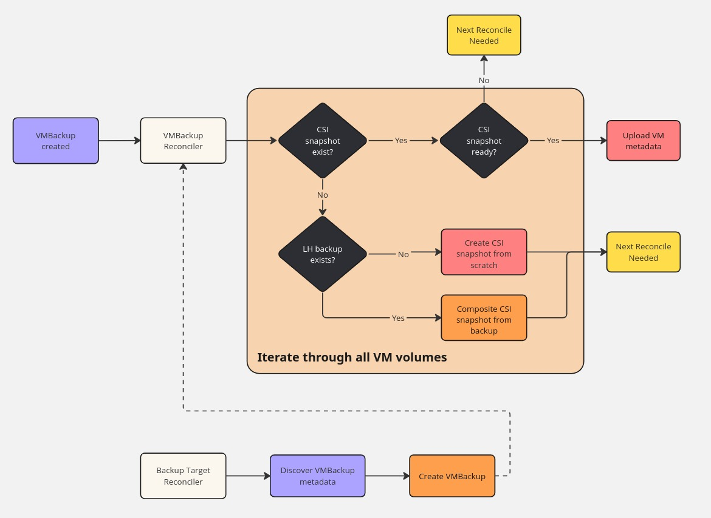

# VM Image Backup & Restore with Longhorn and Harvester

This document provides a detailed overview, best practices, and known issues for integrating backing images and performing VM backup/restore operations using Longhorn (LH) and Harvester. It is intended for knowledge sharing and documentation purposes, helping administrators and users ensure reliable VM image management, backup, and disaster recovery in Harvester.

## Features
- **Backing image integration with VM image controller:**
  Seamlessly connects Harvester's VM image management with Longhorn's backing image mechanism, enabling efficient storage and sharing of base images across multiple VMs.
- **VM backup and restore via Longhorn CSI snapshots:**
  Utilizes Longhorn's CSI snapshot and backup features to create consistent, point-in-time copies of VM volumes, supporting both local and remote backup targets.
- **Handling VM metadata (secrets, images) during backup/restore:**
  Ensures that all critical VM metadata—including secrets, cloud-init data, and image references—are preserved and restored alongside volume data, enabling full VM recovery.

## Backing Image Integration
Backing images are base disk images used to provision VM volumes efficiently. Harvester integrates with Longhorn to automate the lifecycle of these images.

- **Resources Created:**
  - `BackingImage`: A Longhorn resource named `vmi-<VM image UUID>`, representing the backing image for a specific VM image.
  - `StorageClass`: A dynamically created StorageClass named `longhorn-<VM image name>`, allowing VMs to reference the correct backing image when provisioning volumes.
- **Reconciler Logic:**
  - If there are no ready replicas of the backing image, the VM image status is set to `in progress`, indicating that the image is still being prepared.
  - Once at least one replica is ready, the VM image status is updated to `imported`, signaling that the image is available for use by VMs.
- **Control Flow:**
  The process is managed by a controller that monitors the state of backing images and updates VM image resources accordingly. See the diagram below for a visual representation:
  
  

## VM Backup via Longhorn
Longhorn provides robust backup capabilities for VM volumes, supporting both local and remote (e.g., NFS, S3) backup targets.

- **Backup Process:**
  1. For each VM volume, a CSI snapshot is created and a backup is triggered. This ensures data consistency and enables point-in-time recovery.
  2. VM metadata—including secrets, cloud-init data, and image references—is exported and uploaded to remote storage alongside the volume backups.
  3. During restore, both the volume data and metadata are retrieved to fully reconstruct the VM.
- **Snapshot Handle Format:**
  - If the VM backup is discovered from remote storage (not created from scratch locally), the snapshot handle in `VolumeSnapshotContent` uses a composite format: `bak://<volume name>/<backup name>`, uniquely identifying the backup location and volume. For VMBackups created locally, the handle may use a different or simpler format.
- **Control Flow:**
  The backup workflow is illustrated below, showing the interaction between Harvester, Longhorn, and remote storage:

## VM Restore via Longhorn
Restoring a VM involves recovering both the volume data and associated metadata, ensuring the VM can be started in the same or a different environment.

- **Same Namespace Restore:**
  - New volumes are created from existing CSI snapshots.
  - VM secrets and metadata are restored.
  - The VM is started using the recovered resources.
- **Cross-Namespace/Cluster Restore:**
  - New CSI snapshots are composed from the backup data.
  - New volumes are created from these snapshots.
  - VM metadata is restored, and the VM is started in the new environment.
- **Control Flow:**
  The following diagram outlines the restore process:

## Known Issues
Be aware of the following issues and their workarounds when using Longhorn and Harvester for VM backup and restore:

- **Longhorn Manager crash on backing image eviction:** ([#10464](https://github.com/longhorn/longhorn/issues/10464))
  - Evicting a backing image may cause the Longhorn manager to crash. Monitor the issue tracker for updates and avoid unnecessary evictions.
- **Backing image corruption during upgrade to v1.4.0:** ([#7958](https://github.com/harvester/harvester/issues/7958), [#10644](https://github.com/longhorn/longhorn/issues/10644))
  - Upgrading from v1.3.2 to v1.4.0 can corrupt backing images. Follow the [official workaround](https://docs.harvesterhci.io/v1.4/upgrade/v1-3-2-to-v1-4-0#preventing-corruption-of-vm-images-during-upgrade) to prevent data loss.
- **Backups removed if NFS disconnects/reconnects:** ([#9530](https://github.com/longhorn/longhorn/issues/9530))
  - If the NFS backup target disconnects and reconnects, backups may be deleted. Ensure stable network connectivity for backup storage.
- **Restore to another namespace/cluster broken (fixed before v1.5.0):** ([#7539](https://github.com/harvester/harvester/issues/7539))
  - Restoring VMs to a different namespace or cluster was broken in earlier versions. Upgrade to v1.5.0 or later for a fix.

## References
- [Harvester Documentation](https://docs.harvesterhci.io/): Official documentation for Harvester, including VM management, backup, and restore guides.
- [Longhorn Documentation](https://longhorn.io/docs/): Official documentation for Longhorn, covering storage, backup, and disaster recovery features.