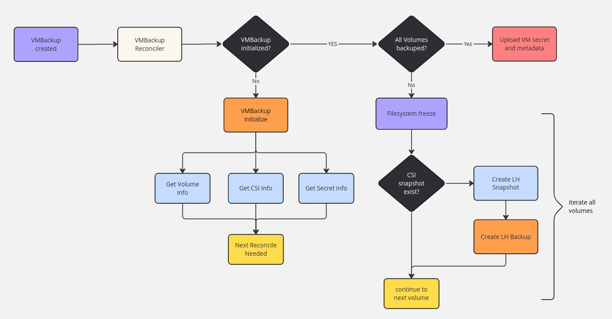
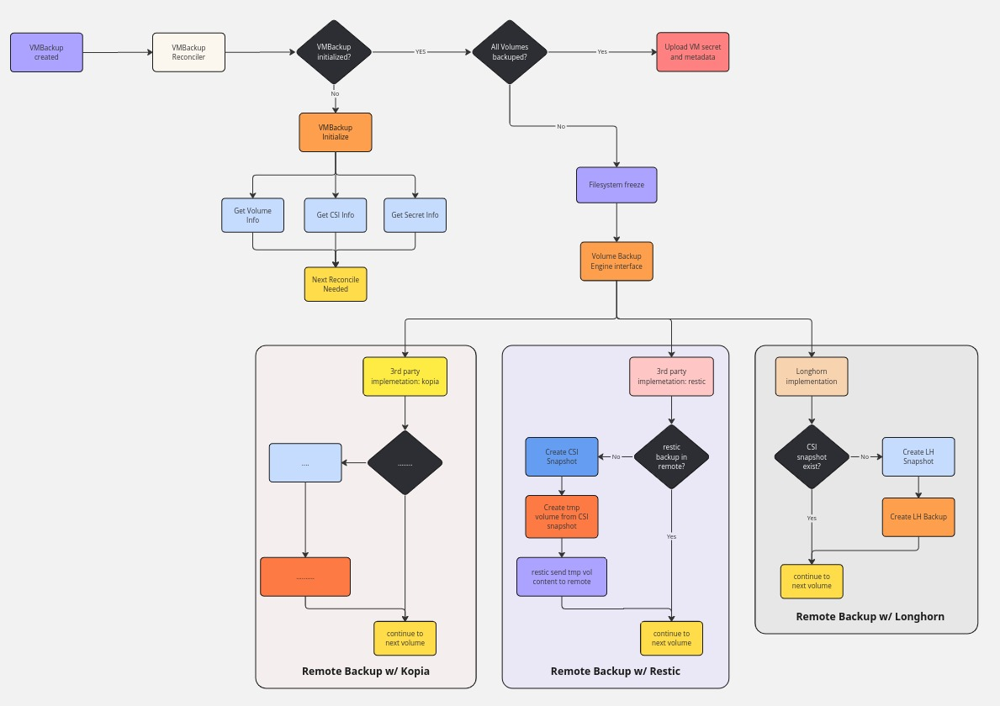
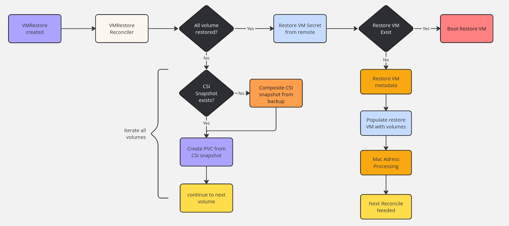
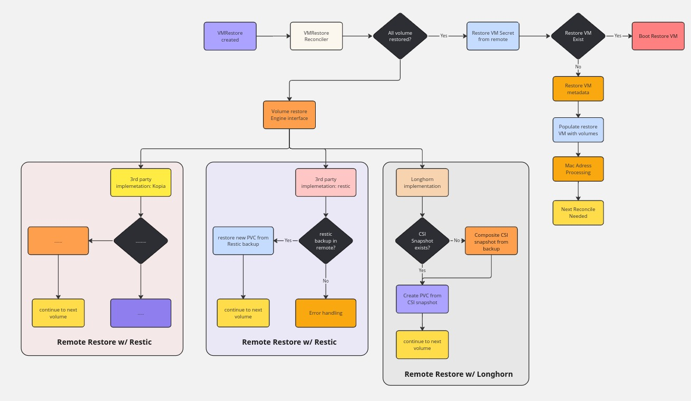

# Built-in Third-Party Backup and Restore Solution for Harvester

## Overview

This document outlines the motivation, proposal, and comparative analysis for implementing a built-in backup and restore solution for Harvester versus existing third-party solutions.

## Motivation

### 1. Filesystem Freeze for Data Consistency

Harvester controller provides filesystem freeze capability during backup creation to ensure data consistency, a critical feature not available in existing third-party backup solutions.

- **Current Implementation**: Harvester implements filesystem freeze through its controller
  - [Implementation Reference](https://github.com/harvester/harvester/blob/9ec30625bd52551bd835b291f309dd4396fb970a/pkg/controller/master/backup/backup.go#L604-L606)
- **Gap in Third-Party Solutions**: Solutions like Velero do not support this essential feature, potentially leading to inconsistent backups

### 2. Granular Control of Backup and Restore Operations

Exsisting third-party backup solutions lack the specialized granularity required for effective VM-level operations in Harvester environments.

- **Current Limitations**: 
  - Third-party solutions like Velero are not designed for per-VM backup and restore operations
    - Harvester creates VM-specific resources and annotations that require specialized handling, which falls outside the scope of general-purpose backup tools
  - These solutions are architected for namespace-level operations managing multiple VMs collectively, rather than individual VM lifecycle management
  - [Related Discussion](https://github.com/harvester/harvesterhci.io/pull/85#discussion_r2137290898)

### 3. Enhanced Flexibility

#### Data Engine Support
- **Current Limitations**: Third-party solutions like Velero primarily support limited data engines (e.g., Kopia)
- **Harvester Advantage**: Can provide a general interface to accommodate multiple data engines:
  - Longhorn
  - Restic
  - Kopia
  - Custom engines

#### Storage Provider Flexibility
- **Current Limitations**: Most third-party solutions require backup and restore to use the same storage class due to manifest-centric design
- **Harvester Advantage**: Can support storage class migration during restore operations
  - Example: Backup from Longhorn, restore to LVM
  - Cross-platform compatibility

## Predictive Comparison: Envisioned Built-in Solution vs. Current Third-Party Approaches

Based on the identified gaps and requirements, this section presents an imaginative comparison between a potential built-in Harvester backup/restore solution and existing third-party alternatives, highlighting the anticipated advantages and trade-offs.

| Feature/Aspect | Envisioned Harvester Built-in Backup/Restore | Current Third-Party Solutions (Velero as Example) |
|---|---|---|
| **Data Consistency** | ✅ Built-in filesystem freeze support ensures application-consistent backups | ❌ Lacks support for application-consistent backups |
| **Granular Control** | ✅ Fine-grained control with per-VM backup and restore capabilities ✅ VM-related resources and manifest sanitization support | ❌ Not optimized for per-VM operations ❌ Limited granularity for individual VM lifecycle management |
| **Data Engine Support** | ✅ Multi-engine flexibility through unified interface ✅ Support for Longhorn, Restic, Kopia, and custom engines | ❌ Limited data engine support (primarily Kopia)  |
| **Storage Migration** | ✅ Cross-storage-class restore capabilities ✅ Example: Backup from Longhorn, restore to LVM | ❌ Limited flexibility for cross-storage-class operations ❌ Typically requires same storage class for backup and restore |
| **Native Integration** | ✅ Deep integration with Harvester ecosystem  | ❌ General-purpose design not optimized for Harvester ❌ Harder to customize for specific Harvester requirements |
| **Maturity & Community** | ⚠️ New solution requiring development  | ✅ Established solution with extensive community support ✅ Comprehensive documentation and tutorials ✅ Large user base and active development |
| **Development & Maintenance** | ⚠️ Ongoing development and maintenance effort required ⚠️ Initial development investment needed ⚠️ Comprehensive testing across multiple scenarios | ✅ Mature codebase with proven stability ✅ Community-driven maintenance and updates |

## Proposal

### 1. VM Backup Architecture

#### Current Architecture

#### Proposed Architecture

*Note: This proposed architecture is based on the Proof of Concept implementation available at [k8s-blk-pvc-backup-restore](https://github.com/WebberHuang1118/k8s-blk-pvc-backup-restore)*

#### Design Principles
- Maintain the same proven control flow as Harvester's current VM backup implementation
- Leverage continuous resilience improvements since v0.3.0
- Implement a general interface to accommodate multiple data backup engines

### 2. VM Restore Architecture

#### Current Architecture

#### Proposed Architecture

*Note: This proposed architecture is based on the Proof of Concept implementation available at [k8s-blk-pvc-backup-restore](https://github.com/WebberHuang1118/k8s-blk-pvc-backup-restore)*

#### Design Principles
- Maintain the same proven control flow as Harvester's current VM restore implementation
- Leverage continuous resilience improvements since v0.3.0
- Implement a general interface to accommodate multiple data restore engines

## Conclusion

The built-in backup and restore solution offers certain advantages for Harvester users, particularly in terms of data consistency, operational flexibility, and native integration. While the development and maintenance costs are considerations, the benefits in terms of user experience, data integrity, and operational control make it a compelling solution for enterprise virtualization environments.

## Next Steps

### Implementation Roadmap

#### Phase 1: Foundation (Target: v1.7.0)
- **Common Abstraction Layer**: Implement unified backup/restore interface framework
- **Filesystem Freeze Integration**: Integrate with existing Harvester filesystem freeze capabilities
- **Basic Backup/Restore Operations**: Support for single VM backup/restore with Longhorn storage

#### Phase 2: Enhanced Features (Target: v1.8.0)
- **Core Data Engine Implementation**: Implement one core data engine (e.g., restic) for VM backup/restore with third-party storage providers
- **Cross-Storage Provider Support**: Enable backup with one storage provider and restore with another storage provider (e.g., backup with Longhorn and restore to LVM)
- **UI Integration**: Integrate backup/restore functionality into Harvester UI

#### Phase 3: Advanced Capabilities (Target: v1.9.0)
- **Scheduling and Automation**: Implement backup scheduling with configurable retention policies

#### Phase 4: Enterprise Readiness (Target: TBD)

##### Production-Grade Enhancements
- **User Experience Optimization**: Refined interface and workflow improvements based on feedback and real-world deployment insights
- **Feature Expansion**: Additional enterprise capabilities driven by production use cases and operational requirements

##### Legacy System Migration
- **Seamless VMBackup Transition**: Zero-downtime migration path from existing Harvester VMBackup infrastructure to enhanced third-party backup engines
- **Data Continuity Assurance**: Complete backward compatibility with existing backup repositories and restoration capabilities
- **Automated Migration Tools**: Comprehensive migration wizard featuring automated compatibility validation, progress monitoring, and reliable rollback mechanisms